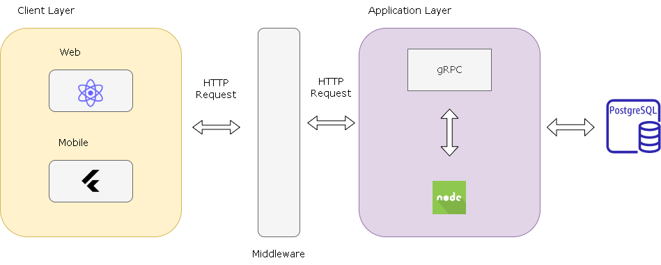
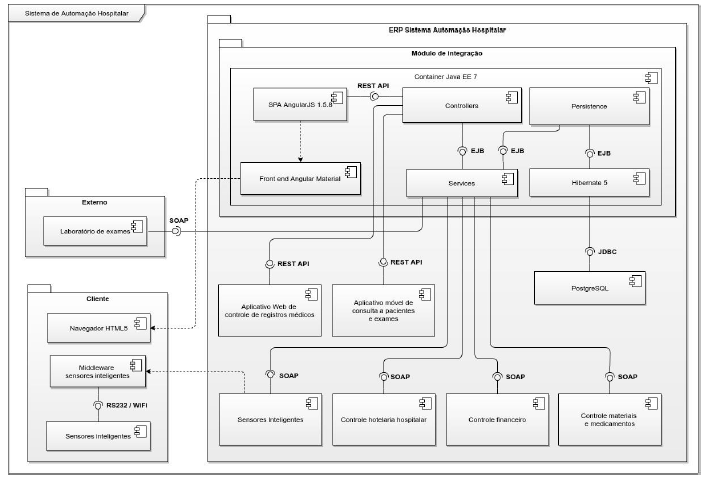

# RACE ENGINEERING 

**Ian Marcel de Campos Ferreira, ian.ferreira@sga.pucminas.br**

**Joey Clapton Maciel Barbosa Santos, jcmbsantos@sga.pucminas.br**

**Lorrayne Reis Silva, lorrayne.silva.1220819@sga.pucminas.br**

**Octávio Oliveira Rocha, octavio.rocha@sga.pucminas.br**

**Vitor de Souza Xavier, vitor.xavier@sga.pucminas.br**

**Vítor José Lara Bastos, vitor.bastos@sga.pucminas.br**

---

Professores:

**Cleiton Silva Tavares**

**Aline Norberta de Brito**

---

_Curso de Engenharia de Software, Unidade Praça da Liberdade_

_Instituto de Informática e Ciências Exatas – Pontifícia Universidade de Minas Gerais (PUC MINAS), Belo Horizonte – MG – Brasil_

---

---

## Histórico de Revisões

| **Data** | **Autor** | **Descrição** | **Versão** |
| --- | --- | --- | --- |
| **[dd/mm/aaaa]** | [Nome do autor] | [Descrever as principais alterações realizadas no documento, evidenciando as seções ou capítulos alterados] | [X] |
| **23/02/2023**| Lorrayne Reis| Cabeçalho inicial e resumo | 1.0 |
| **27/02/2023**| Ian Marcel| Requisitos Funcionais e Não Funcionais | 1.0 |
| **28/02/2023**| Lorrayne Reis| Sessão Apresentação Completa | 1.0 |
| **01/30/2023**| Vítor José| Modelagem e projeto arquitetural | 1.0 |
| | | | |

## SUMÁRIO

1. [Apresentação](#apresentacao "Apresentação")  
	1.1. Problema  
	1.2. Objetivos do trabalho  
	1.3. Definições e Abreviaturas  

2. [Requisitos](#requisitos "Requisitos")  
'	2.1. Requisitos Funcionais  
	2.2. Requisitos Não-Funcionais  
	2.3. Restrições Arquiteturais  
	2.4. Mecanismos Arquiteturais  

3. [Modelagem](#modelagem "Modelagem e projeto arquitetural")  
	3.1. Visão de Negócio  
	3.2. Visão Lógica  
	3.3. Modelo de dados (opcional)  

4. [Avaliação](#avaliacao "Avaliação da Arquitetura")  
	4.1. Cenários  
	4.2. Avaliação  

5. [Referências](#referencias "REFERÊNCIAS") 

6. [Apêndices](#apendices "APÊNDICES") 

# 1. Apresentação

<div align="justify"

*Porsche Carrera Cup* é uma competição automobilística que utiliza apenas *Porsche Carrera* preparados para as pistas, o Brasil passou a ter seu campeonato com 2005. Essa é inteiramente organizada por uma única empresa, possibilitando igualdade de preparação para todos os competidores. O piloto não tem qualquer preocupação com a preparação dos automóveis, ele precisa apenas chegar ao autódromo e correr. 

Nas corridas de *Endurance* são 60 pilotos, distribuídos em 30 carros disputando provas de 300 km e 500 km compostos de três etapas. As duas primeiras corridas são disputadas em duplas e duram 300 km ou 2h45min (o que acontecer primeiro). A prova final, de 500 km, distribui mais pontos e pode ser disputada em trio ou dupla. As etapas acontecem em diferentes pistas e partes do país, com competidores pontuando individualmente no campeonato de Endurance, conforme seus resultados em cada etapa, mas uma dupla pode ser campeã em conjunto. Nas duas primeiras corridas, as vitórias valem 68 pontos. Na terceira, 116. 

Cada time é responsável por definir sua estratégia de revezamento, trocas de pneus e reabastecimento durante as paradas no *box*. Nas provas de 300 km há três *pit-stops* obrigatórios com tempo mínimo de 6 minutos cada. Na prova de 500 km são cinco *pits* obrigatórios. Não é permitido trocar pneu e reabastecer simultaneamente. Cada piloto tem que realizar uma quilometragem mínima para validar o resultado do carro. No Velocitta o mínimo corresponde a 36 voltas, em Goiânia são 32 e, em Interlagos 48 (para tripulações competindo em duplas) ou 32 (para os trios). O *quali* acontece com quatro sessões de 10 minutos e todos os pilotos necessariamente têm que ir para a pista nas duas primeiras etapas.  

Na etapa de 500 km, no caso de tripulações com três pilotos, participam do *quali* os competidores de maior e menor *BOP*. *BoP* (*Balance of Performance*) equalizam os carros com lastros distribuídos de acordo com o repertório e idade dos pilotos e determinam também deduções de tempo nas paradas obrigatórias para revezamento dos pilotos. Os carros aceleram separadamente no treino de formação do *grid* de largada. Primeiro registram voltas os competidores de menor *BOP*, na sessão seguinte, os de maior *BOP*. O *grid* é apurado pela média das melhores voltas de cada piloto. Se houver empate na média, leva vantagem o carro que tiver registrado a melhor passagem em termos absolutos. 

## 1.1. Problema

A problemática se instaura na grande quantidade de informações a serem rastreadas e mantidas no pré, durante e pós-corrida para definição de estratégias e *performance*. Logo, é necessário um controle de corridas, pilotos, *laps* e consumo de combustível, em sua maioria realizado via planilhas de Excel ou em papel de modo arcaico. Diversos engenheiros afirmam que as planilhas já falharam durante corridas, comprometendo performance e levando a perda de pontos em campeonato. Outra problemática em dominância se demonstra na não absorção de informações ou baixo entendimentos de Engenheiro Mecânico e Pilotos ao se perderem nas informações fornecidas pelas planilhas, além de necessitarem algumas vezes de apenas informações referenciais de sua atuação e não possuírem uma visão única para tal. Ademais, durante corrida o Engenheiro de pista quando ocorre a troca de pilotos do carro, precisa passar informações constantemente ao piloto que saiu do carro sobre sua performance, o que leva a perda de tempo com piloto principal que está no carro atuando.

## 1.2. Objetivos do trabalho

O objetivo central do trabalho se concentra em desenvolver um *software* com as duas problemáticas principais demonstradas no tópico anterior: gerenciamento total de corridas e visões de *performance* diferentes. Para isso serão desenvolvidas uma aplicação *mobile* e uma *web* com o intuito de focalizar o processo de diferentes *views* atendendo necessidades de todas as partes interessadas. Objetivando uma aplicação que vise possibilitar o gerenciamento de informações por parte do Engenheiro de Pista, oferecendo informações previsionais de clima, permitindo visualização de performance ao piloto, demonstrando informações de tempo e voltas decorrentes e provendo um *chat* entre os envolvidos. Os pontos principais aprofundados se concentram na atualização de informações em tempo real a todos os desenvolvidos, o armazenamento de informações e o *chat* para comunicação. 
 

## 1.3. Definições e Abreviaturas

*Porsche Carrera Cup* – Corridas realizadas com o carro Porsche Carrera. 

*Porsche Carrera* – *Porsche* utilizado nas corridas que possui pequenas alterações para ser utilizado em pistas. 

Corridas de *Endurance* – Corridas de longa duração ou com maior duração que as corridas *Porsche Sprint*. 

*Box* - Local no autódromo destinado a alocamento de uma equipe durante a corrida.

*Laps* - Voltas realizadas pelos pilotos no circuito.

Estratégia de revezamento - Estratégia calculada para definir quantas voltas o piloto principal vai fazer no carro e quantas voltas o piloto secundário vai realizar no objetivo de obter maior *performance*. 

*Pit-stops* - Paragem durante uma corrida na área das boxes onde se encontram as equipes e seus mecânicos, para que durante a corrida os pilotos possam trocar de pneus, fazer o reabastecimento de combustível dos seus veículos ou realizar a troca entre pilotos. 

*Quali* - O "*Quali*" vem de "*Qualifying*", que em inglês quer dizer "Qualificação" ou "Classificação". E, como a ordem numérica sugere, são as fases do treino de classificação que define o *grid* de largada na corrida. 

*BOP* -  *Balance of Performance* , equalizam os carros com lastros distribuídos de acordo com o repertório e idade dos pilotos e determinam também deduções de tempo nas paradas obrigatórias para revezamento dos pilotos. 

*Grid* de largada – Local onde todos os carros se reúnem com definição marcada  e de posição de classificação para o começo da corrida.

*Performance* - Realizar, completar, executar ou efetivar. 
 

# 2. Requisitos

_Esta seção descreve os requisitos comtemplados nesta descrição arquitetural, divididos em dois grupos: funcionais e não funcionais._

## 2.1. Requisitos Funcionais

_Enumere os requisitos funcionais previstos para a sua aplicação. Concentre-se nos requisitos funcionais que sejam críticos para a definição arquitetural. Lembre-se de listar todos os requisitos que são necessários para garantir cobertura arquitetural. Esta seção deve conter uma lista de requisitos ainda sem modelagem. Na coluna Prioridade utilize uma escala (do mais prioritário para o menos): Essencial, Desejável, Opcional._

| **ID** | **Descrição** | **Prioridade** |
| --- | --- | --- |
| RF001 | O mecanico deve conseguir consultar a performace do pneu|Essencial |
| RF002 |O Usuario deve poder cadastrar uma corrida | Essencial |
| RF003 |O Analista deve ser capaz de consultar o tempo das voltas | Essencial |
| RF004 |O Analista deve conseguir inserir os dados e calculos das corridas |Desejável |
| RF005 |O Sistema deve mostar o clima para a devida localidade | Desejável|
| RF006 |O Usuario deve ser capaz de trocar mensagens pelo chat | Opcional|

Obs: acrescente mais linhas, se necessário.

## 2.2. Requisitos Não-Funcionais

_Enumere os requisitos não-funcionais previstos para a sua aplicação. Entre os requisitos não funcionais, inclua todos os requisitos que julgar importante do ponto de vista arquitetural ou seja os requisitos que terão impacto na definição da arquitetura. Os requisitos devem ser descritos de forma completa e preferencialmente quantitativa._

| **ID** | **Descrição** |
| --- | --- |
| RNF001 | O sistema deve autenticar e validar os usuários para ter acesso às suas devidas funcionalidades|
| RNF002 | O tempo de resposta das consultas deve ser inferior a 5 segundos.|
| RNF003 | O sistema deve possuir armazenamento local no mobile com o SQLite|
| | |
| | |
| | |

Obs: acrescente mais linhas, se necessário.

## 2.3. Restrições Arquiteturais

As restrições impostas ao projeto que afetam sua arquitetura são:

- A camada de apresentação front-end deverá ser desenvolvida usando o framework Next.js;
- A aplicação backend deverá utilizar NodeJS com o ORM Sequelize;
- A aplicação mobile deverá utilizar Flutter com Postgresql;
- As aplicações mobile, back-end e front-end deverão estar em ambientes na nuvem;
- Não deverá ser usado o firebase como arquitetura de mensageria;

## 2.4. Mecanismos Arquiteturais

_Visão geral dos mecanismos que compõem a arquitetura do sosftware baseando-se em três estados: (1) análise, (2) design e (3) implementação. Em termos de Análise devem ser listados os aspectos gerais que compõem a arquitetura do software como: persistência, integração com sistemas legados, geração de logs do sistema, ambiente de front end, tratamento de exceções, formato dos testes, formato de distribuição/implantação (deploy), entre outros. Em Design deve-se identificar o padrão tecnológico a seguir para cada mecanismo identificado na análise. Em Implementação, deve-se identificar o produto a ser utilizado na solução.
 Ex: Análise (Persistência), Design (ORM), Implementação (Hibernate)._

| **Análise** | **Design** | **Implementação** |
| --- | --- | --- |
| Persistência | ORM | Hibernate |
| Front end | API| Next.js|
| Back end |API |NodeJS com o ORM Sequelize |
| Integração | API |ORM Sequelize |
| Log do sistema | Web services| Node.js |
| Teste de Software | API| Postman.|
| Deploy | API| Node.js |

# 3. Modelagem e projeto arquitetural

Para solucionar o problema proposto, difiniu-se a estratégia arquitetural que se baseia na utlização do React para o desenvolvimento web e Flutter para o mobile, ambos sendo ultizados no Fornt-End e se encaixando no Client Layer. Entrando na Application Layer, a linguagem Node.Js será abordada para o desenvolvimento do Back-End e o protocolo que garantirá uma comunicação rápida e eficiente será o gRPC com Rest API, que garantirá uma economia de tempo e recursos dentro do presente sistema distrtibuído.
A comunicação entre o Cliente Layer e a Application layer será feita por meio de requests usando o protocolo HTTP, tendo como intermediário entre estas duas aplicações o Software Middleware, que trará uma melhor eficiência, simplificará a manutenção do sistema através de seus serviços de integração, segurança e gerenciamento de rede.

**Figura 1 - Diagrama de visão geral**

## 3.1. Visão de Negócio (Funcionalidades)

1. O sistema deve prover acesso aos pilotos, mecânicos e analista
2. O sistema deve permitir cadastro de corridas
3. O sistema deve permitir a consulta de dados da corrida
4. O sistema deve permitir o cadastro de dados da corrida
5. O sistema deve fazer cálculos baseados nos dados da corrida e gerar informações baseadas no dados
6. O sistema deve prover um chat para comunicação dos usuário

Obs: a quantidade e o escopo das funcionalidades deve ser negociado com os professores/orientadores do trabalho.

### Descrição resumida dos Casos de Uso / Histórias de Usuário

_Nesta seção, os casos de uso devem ser resumidos. Esse detalhamento pode ser na forma de um texto sintético ou, alternativamente, você pode optar por descrever estórias de usuários seguindo os métodos ágeis. Neste caso a seção deve chamar &quot;Histórias de usuários&quot;. Lembre-se das características de qualidade das estórias de usuários, ou seja, o que é preciso para descrever boas histórias de usuários._

Exemplos de resumo de Casos de Uso:

#### UC01 – NOME DO CASO DE USO 01

| **Descrição** | |
| --- | --- |
| **Atores** | |
| **Prioridade** | |
| **Requisitos associados** | |
| **Fluxo Principal** | |

#### UC02 – NOME DO CASO DE USO 02

| **Descrição** | |
| --- | --- |
| **Atores** | |
| **Prioridade** | |
| **Requisitos associados** | |
| **Fluxo Principal** | |

Exemplos de Histórias de Usuário:

- Como Fulano eu quero poder convidar meus amigos para que a gente possa se reunir...

- Como Cicrano eu quero poder organizar minhas tarefas diárias, para que...

- Como gerente eu quero conseguir entender o progresso do trabalho do meu time, para que eu possa ter relatórios periódicos dos nossos acertos e falhas.

## 3.2. Visão Lógica

_Apresente os artefatos que serão utilizados descrevendo em linhas gerais as motivações que levaram a equipe a utilizar estes diagramas._

### Diagrama de Classes

**Figura 2 – Diagrama de classes (exemplo). Fonte: o próprio autor.**

Obs: Acrescente uma breve descrição sobre o diagrama apresentado na Figura 3.

### Diagrama de componentes

_Apresente o diagrama de componentes da aplicação, indicando, os elementos da arquitetura e as interfaces entre eles. Liste os estilos/padrões arquiteturais utilizados e faça uma descrição sucinta dos componentes indicando o papel de cada um deles dentro da arquitetura/estilo/padrão arquitetural. Indique também quais componentes serão reutilizados (navegadores, SGBDs, middlewares, etc), quais componentes serão adquiridos por serem proprietários e quais componentes precisam ser desenvolvidos._

**Figura 3 – Diagrama de Componentes (exemplo). Fonte: o próprio autor.**

_Apresente uma descrição detalhada dos artefatos que constituem o diagrama de implantação._

Ex: conforme diagrama apresentado na Figura X, as entidades participantes da solução são:

- **Componente 1** - Lorem ipsum dolor sit amet, consectetur adipiscing elit. Cras nunc magna, accumsan eget porta a, tincidunt sed mauris. Suspendisse orci nulla, sagittis a lorem laoreet, tincidunt imperdiet ipsum. Morbi malesuada pretium suscipit.
- **Componente 2** - Praesent nec nisi hendrerit, ullamcorper tortor non, rutrum sem. In non lectus tortor. Nulla vel tincidunt eros.

## 3.3. Modelo de dados (opcional)

_Caso julgue necessário para explicar a arquitetura, apresente o diagrama de classes ou diagrama de Entidade/Relacionamentos ou tabelas do banco de dados. Este modelo pode ser essencial caso a arquitetura utilize uma solução de banco de dados distribuídos ou um banco NoSQL._

 ")

**Figura 4 – Diagrama de Entidade Relacionamento (ER) - exemplo. Fonte: o próprio autor.**

Obs: Acrescente uma breve descrição sobre o diagrama apresentado na Figura 3.

# 4. Avaliação da Arquitetura

_Esta seção descreve a avaliação da arquitetura apresentada, baseada no método ATAM._

## 4.1. Cenários

_Apresente os cenários de testes utilizados na realização dos testes da sua aplicação. Escolha cenários de testes que demonstrem os requisitos não funcionais sendo satisfeitos. Os requisitos a seguir são apenas exemplos de possíveis requisitos, devendo ser revistos, adequados a cada projeto e complementados de forma a terem uma especificação completa e auto-explicativa._

**Cenário 1 - Acessibilidade:** Suspendisse consequat consectetur velit. Sed sem risus, dictum dictum facilisis vitae, commodo quis leo. Vivamus nulla sem, cursus a mollis quis, interdum at nulla. Nullam dictum congue mauris. Praesent nec nisi hendrerit, ullamcorper tortor non, rutrum sem. In non lectus tortor. Nulla vel tincidunt eros.

**Cenário 2 - Interoperabilidade:** Pellentesque habitant morbi tristique senectus et netus et malesuada fames ac turpis egestas. Fusce ut accumsan erat. Pellentesque in enim tempus, iaculis sem in, semper arcu.

**Cenário 3 - Manutenibilidade:** Phasellus magna tellus, consectetur quis scelerisque eget, ultricies eu ligula. Sed rhoncus fermentum nisi, a ullamcorper leo fringilla id. Nulla lacinia sem vel magna ornare, non tincidunt ipsum rhoncus. Nam euismod semper ante id tristique. Mauris vel elit augue.

**Cenário 4 - Segurança:** Suspendisse consectetur porta tortor non convallis. Sed lobortis erat sed dignissim dignissim. Nunc eleifend elit et aliquet imperdiet. Ut eu quam at lacus tincidunt fringilla eget maximus metus. Praesent finibus, sapien eget molestie porta, neque turpis congue risus, vel porttitor sapien tortor ac nulla. Aliquam erat volutpat.

## 4.2. Avaliação

_Apresente as medidas registradas na coleta de dados. O que não for possível quantificar apresente uma justificativa baseada em evidências qualitativas que suportam o atendimento do requisito não-funcional. Apresente uma avaliação geral da arquitetura indicando os pontos fortes e as limitações da arquitetura proposta._

| **Atributo de Qualidade:** | Segurança |
| --- | --- |
| **Requisito de Qualidade** | Acesso aos recursos restritos deve ser controlado |
| **Preocupação:** | Os acessos de usuários devem ser controlados de forma que cada um tenha acesso apenas aos recursos condizentes as suas credenciais. |
| **Cenários(s):** | Cenário 4 |
| **Ambiente:** | Sistema em operação normal |
| **Estímulo:** | Acesso do administrador do sistema as funcionalidades de cadastro de novos produtos e exclusão de produtos. |
| **Mecanismo:** | O servidor de aplicação (Rails) gera um _token_ de acesso para o usuário que se autentica no sistema. Este _token_ é transferido para a camada de visualização (Angular) após a autenticação e o tratamento visual das funcionalidades podem ser tratados neste nível. |
| **Medida de Resposta:** | As áreas restritas do sistema devem ser disponibilizadas apenas quando há o acesso de usuários credenciados. |

**Considerações sobre a arquitetura:**

| **Riscos:** | Não existe |
| --- | --- |
| **Pontos de Sensibilidade:** | Não existe |
| _ **Tradeoff** _ **:** | Não existe |

Evidências dos testes realizados

_Apresente imagens, descreva os testes de tal forma que se comprove a realização da avaliação._

# 5. REFERÊNCIAS

_Como um projeto da arquitetura de uma aplicação não requer revisão bibliográfica, a inclusão das referências não é obrigatória. No entanto, caso você deseje incluir referências relacionadas às tecnologias, padrões, ou metodologias que serão usadas no seu trabalho, relacione-as de acordo com a ABNT._

Verifique no link abaixo como devem ser as referências no padrão ABNT:

http://www.pucminas.br/imagedb/documento/DOC\_DSC\_NOME\_ARQUI20160217102425.pdf

**[1]** - _ELMASRI, Ramez; NAVATHE, Sham. **Sistemas de banco de dados**. 7. ed. São Paulo: Pearson, c2019. E-book. ISBN 9788543025001._

**[2]** - _COPPIN, Ben. **Inteligência artificial**. Rio de Janeiro, RJ: LTC, c2010. E-book. ISBN 978-85-216-2936-8._

**[3]** - _CORMEN, Thomas H. et al. **Algoritmos: teoria e prática**. Rio de Janeiro, RJ: Elsevier, Campus, c2012. xvi, 926 p. ISBN 9788535236996._

**[4]** - _SUTHERLAND, Jeffrey Victor. **Scrum: a arte de fazer o dobro do trabalho na metade do tempo**. 2. ed. rev. São Paulo, SP: Leya, 2016. 236, [4] p. ISBN 9788544104514._

**[5]** - _RUSSELL, Stuart J.; NORVIG, Peter. **Inteligência artificial**. Rio de Janeiro: Elsevier, c2013. xxi, 988 p. ISBN 9788535237016._

# 6. APÊNDICES

_Inclua o URL do repositório (Github, Bitbucket, etc) onde você armazenou o código da sua prova de conceito/protótipo arquitetural da aplicação como anexos. A inclusão da URL desse repositório de código servirá como base para garantir a autenticidade dos trabalhos._
